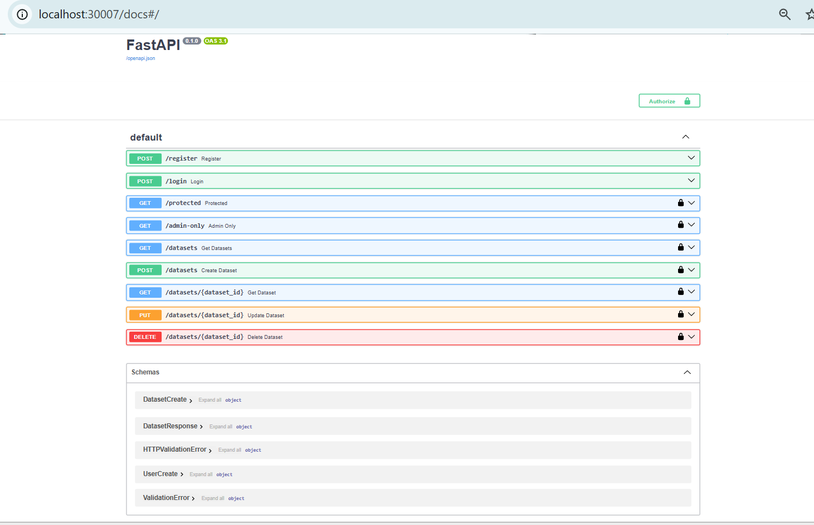
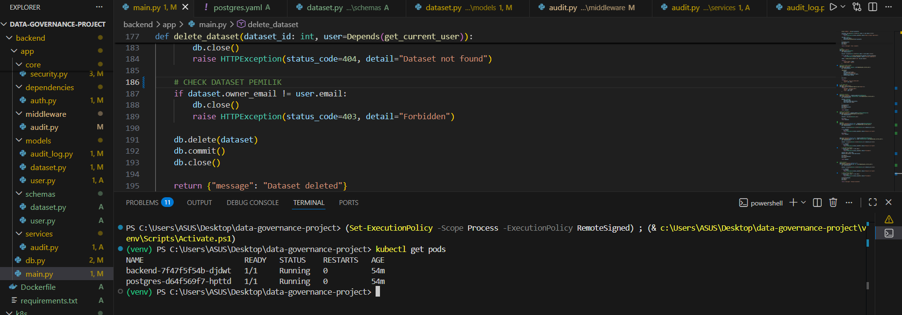
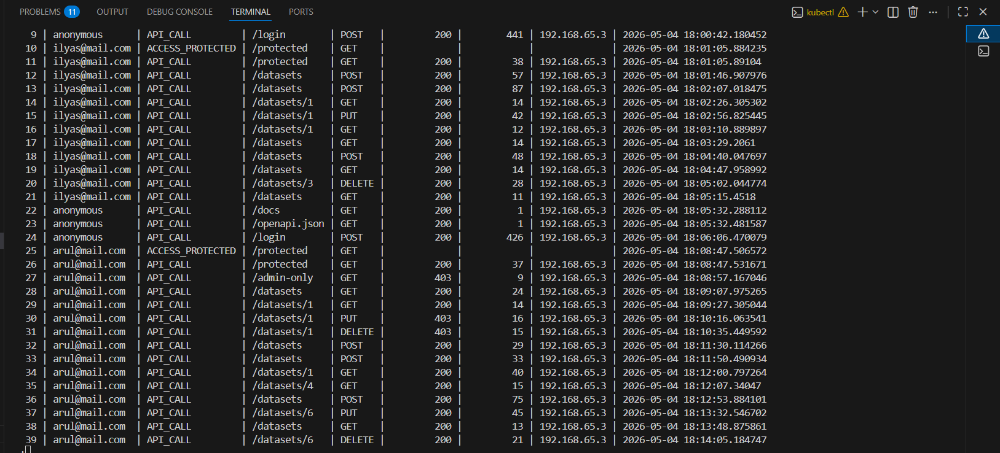
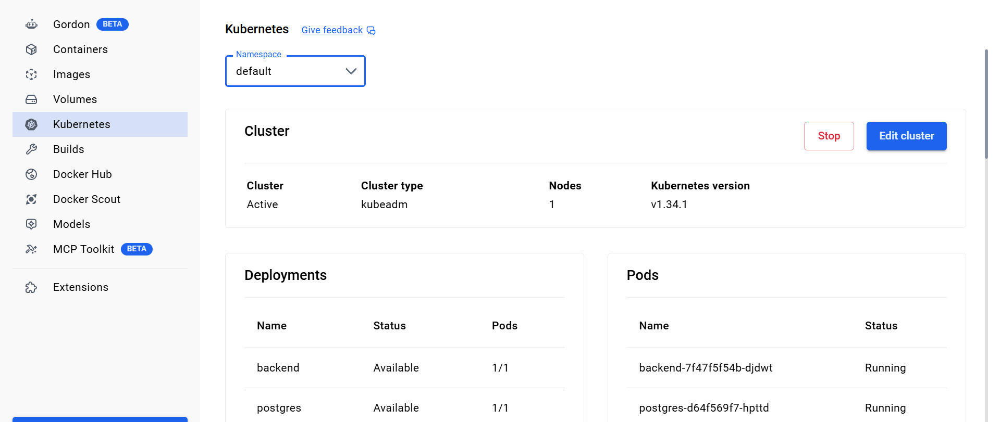

# Data Governance Platform (FastAPI + PostgreSQL + Kubernetes)

## Overview

This project is a backend system for managing datasets with role-based access control (RBAC) and audit logging.
It simulates a real-world **data governance platform** used in modern organizations to manage data ownership, access, and activity tracking.

---

## Tech Stack

* **Backend**: FastAPI (Python)
* **Database**: PostgreSQL
* **ORM**: SQLAlchemy
* **Authentication**: JWT (JSON Web Token)
* **Containerization**: Docker
* **Orchestration**: Kubernetes
* **Configuration**: ConfigMap & Secret

---

## Core Features

### Authentication & Authorization

1. User Registration & Login
2. JWT-based authentication
3. Role-Based Access Control (Admin & User)

---

### Protected Routes

- `/protected` - accessible for authenticated users
- `/admin-only` - accessible only for admin

---

### Dataset Management

- Create dataset
- View datasets
- Update dataset (owner only)
- Delete dataset (owner only)

---

### Ownership System

- Each dataset has an owner
- Only the owner can modify/delete the dataset

---

### Audit Logging

- Logs every API request
- Stores:
user email, endpoint, method, status code, latency, IP address

---

### Kubernetes Deployment

- Backend deployed as Deployment
- PostgreSQL deployed as Deployment
- Services for internal communication
- ConfigMap & Secret for environment variables

---

## Architecture

User → FastAPI (Backend API) → PostgreSQL (Database)

Deployed using Docker & Kubernetes

---

### API Documentation (Swagger)

---

### Kubernetes Pods

---

### Audit Logs

### Docker

